To showcase the basics of Wireup, we will create a container able to inject the following:

- A `WeatherService` that queries a fictional weather api. It needs an api key, a `KeyValueStore` to cache data and an
    async http client to make requests.
- `KeyValueStore` itself needs a `redis_url` denoting the server it will connect to to query/store data.

These will then be retrieved in a `/weather/forecast` endpoint that requires `WeatherService` to provide weather
information.

```mermaid
graph LR
    redis_url[⚙️ redis_url] --> KeyValueStore[🐍 KeyValueStore]
    weather_api_key[⚙️ weather_api_key] --> WeatherService
    KeyValueStore --> WeatherService[🐍 WeatherService]
    WeatherService --> Route[🌎 /weather/forecast]
    F[🏭 HttpClient] --> WeatherService
```



!!! tip

    There will be little `+` icons in code fragments. You can click on those for more detailed information as to what is
    happening in that particular line.

### 1. Define Dependencies

The container uses types and annotations to define dependencies and discover relationships between them. This results in
self-contained definitions without having to create factories for every dependency.

!!! note "`Injected[T]` vs `Inject(...)`"

    `Injected[T]` marks parameters for injection in external call sites. `Inject(...)` describes how to find them (for
    example config keys or qualifiers).

#### 🐍 `KeyValueStore`

To create the `KeyValueStore`, we need a value for `redis_url`. The `@injectable` decorator registers the class, and the
type hint tells the container to inject the value of the `redis_url` key into the `dsn` parameter.

```python title="services/key_value_store.py" hl_lines="6 9"
from wireup import injectable, Inject
from typing import Annotated
import redis


@injectable  # (1)!
class KeyValueStore:
    def __init__(
        self, dsn: Annotated[str, Inject(config="redis_url")]
    ) -> None:  # (2)!
        self.client = redis.from_url(dsn)
```

1. Decorators are only used to collection metadata. This makes testing simpler, as you can still instantiate this like a
    regular class in your tests.
1. Since type-based injection is not possible here (there can be many string/int configs after all), config injection
    must be annotated with the `Inject(config=key)` syntax. This tells the container which config key to inject.

#### 🏭 `aiohttp.ClientSession`

The http client making requests cannot be instantiated directly as we need to enter an async context manager. To
accommodate such cases, Wireup allows you to use functions to create dependencies. These can be sync/async as well as
regular or generator functions if cleanup needs to take place.

Factories can define their dependencies in the function's signature.

!!! note ""

    When using generator factories make sure to call `container.close` when the application is terminating for the necessary
    cleanup to take place.

```python title="services/factories.py" hl_lines="6"
from wireup import injectable
from typing import AsyncIterator
import aiohttp


@injectable
async def http_client_factory() -> AsyncIterator[aiohttp.ClientSession]:
    async with aiohttp.ClientSession() as client:
        yield client
```

#### 🐍 `WeatherService`

Creating `WeatherService` is also straightforward. The `@injectable` decorator creates a unique registration for the
class. Class dependencies do not need additional annotations, even though the http client is created via an async
generator. This is transparently handled by the container.

```python title="services/weather_service.py" hl_lines="6 10 11 12"
from wireup import injectable, Inject
from typing import Annotated
import aiohttp


@injectable
class WeatherService:
    def __init__(
        self,
        api_key: Annotated[str, Inject(config="weather_api_key")],  # (1)!
        kv_store: KeyValueStore,  # (2)!
        client: aiohttp.ClientSession,  # (3)!
    ) -> None: ...
```

1. Same as above, weather api key needs the config key for the container to inject it.
1. `KeyValueStore` can be injected only by type and does not require annotations.
1. `aiohttp.ClientSession` can be injected only by type and requires no additional configuration.

### 2. Create the container

The next step is to create a container and register the dependencies we just defined.

!!! tip "Default Registration Style"

    In production apps, prefer module/package scanning (`injectables=[my_app.services]`) as the default registration style.
    Use explicit class/function lists mainly for small examples, tests, or when you need very tight control over what gets
    registered.

```python title="container.py"
import wireup
from my_app import services
import os

container = wireup.create_async_container(
    # `config` is an optional key-value configuration store.
    # You can inject configuration as necessary by referencing config keys.
    # This allows you to create self-contained service definitions
    # without additional setup code.
    config={  # (1)!
        "redis_url": os.environ["APP_REDIS_URL"],
        "weather_api_key": os.environ["APP_WEATHER_API_KEY"],
    },
    # Let the container know where registrations are located.
    # This is a list of modules containing injectable definitions,
    # or functions/classes decorated with `@injectable`.
    injectables=[services],
)
```

1. `config` is configuration your application needs. Such as an api key, database url, or other settings.

    You can inject them as necessary by their name (dict key) where required. Wireup won't pull things from the
    environment or other places for you. You need to expose to it the different settings you'll need.

    You don't have to use this if you prefer using things like pydantic-settings, but it will enable you to have
    self-contained service definitions without writing additional set-up code to create these objects.

    Note that the values can be literally anything you need to inject and not just int/strings or other scalars. You can
    put dataclasses for example in the config to inject structured configuration.

!!! note "Container variants: Sync and Async"

    Wireup includes two types of containers: async and sync. The difference is that the async one exposes `async def`
    methods for the common operations and is capable of creating resources from `async def` factories.

    The async container can create both regular and resources from async factories.

    If you don't use async in your code you should create a container via `wireup.create_sync_container`. Some integrations
    that Wireup provides also require you to create containers of a given type. E.g: FastAPI integration only supports async
    containers.

### 3. Use

All that's left now is to retrieve dependencies from the container.

=== "Direct Retrieval"

    To fetch dependencies from the container, call `.get` on the container instance with the type you want to retrieve.

    ```python title="views/posts.py"  hl_lines="3"
    @app.get("/weather/forecast")
    async def get_forecast():
        weather_service = await container.get(WeatherService)
        return await weather_service.get_forecast(...)
    ```

=== "Injection via decorator"

    You can also apply Wireup containers as decorators. See [Apply the container as a decorator](function_injection.md) docs
    for more info, but the end result is that you can decorate any function and specify dependencies to inject in it's
    signature.

    ```python title="views/posts.py"  hl_lines="5 6"
    from wireup import Injected, inject_from_container


    @app.get("/weather/forecast")
    @inject_from_container(container)
    async def get_forecast(weather_service: Injected[WeatherService]):
        return await weather_service.get_forecast(...)
    ```

=== "FastAPI"

    With the FastAPI integration you can declare dependencies in http or websocket routes.

    ```python title="views/posts.py"  hl_lines="5"
    from wireup import Injected


    @app.get("/weather/forecast")
    async def get_forecast(weather_service: Injected[WeatherService]):
        return await weather_service.get_forecast(...)
    ```

    Learn More: [FastAPI Integration](integrations/fastapi/index.md).

=== "Flask"

    With the Flask integration you can declare dependencies in views.

    ```python title="views/posts.py"  hl_lines="5"
    from wireup import Injected


    @app.get("/weather/forecast")
    def get_forecast(weather_service: Injected[WeatherService]):
        return weather_service.get_forecast(...)
    ```

    Learn More: [Flask Integration](integrations/flask/index.md).

=== "Django"

    With the Django integration you can declare dependencies in views. The integration provides support for async views,
    regular views as well as class-based views.

    ```python title="views/posts.py"  hl_lines="4"
    from wireup import Injected


    async def get_forecast(weather_service: Injected[WeatherService]):
        return await weather_service.get_forecast(...)
    ```

    Learn More: [Django Integration](integrations/django/index.md).

#### Integrations

While Wireup is framework-agnostic, usage can be simplified when using it alongside one of the integrations. Key
benefits of the integrations are:

- Automatic injection in routes without having to do `container.get` or use decorators.
- Lifecycle management and access to request-scoped dependencies.
- Eliminates the need for a global container variable as containers are bound to the application instance.

Check out the [Integrations](integrations/index.md) page.

### 4. Test

Wireup does not patch your classes, which means they can be instantiated and tested independently of the container.

To substitute dependencies on targets such as views in a web application you can override dependencies with new ones on
the fly.

```python
with container.override.injectable(WeatherService, new=test_weather_service):
    response = client.get("/weather/forecast")
```

Requests to inject `WeatherService` during the lifetime of the context manager will result in `test_weather_service`
being injected instead.

## Conclusion

This concludes the "Getting Started" walkthrough, covering the most common dependency injection use cases.

!!! info

    - Wireup can perform injection on both sync and async targets.
    - If you need to create multiple containers, every container you create is separate from the rest and has its own state.

## Next Steps

- [Injectables](injectables.md)
- [Configuration](configuration.md)
- [Factories](factories.md)
