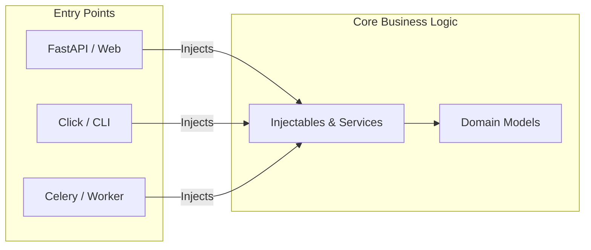

Performant, concise and type-safe Dependency Injection for Python.

[](https://github.com/maldoinc/wireup)
[](https://pypi.org/project/wireup/)
[](https://pypi.org/project/wireup/)

!!! tip "Zero Runtime Overhead"
    **New**: Inject Dependencies in FastAPI with zero runtime overhead using [Class-Based Handlers](integrations/fastapi/class_based_handlers.md).

### ⚡ Clean & Type-Safe DI

Wireup adapts to your architectural style. Use decorators and annotations for concise, co-located definitions,
or use factories to keep your domain model pure and decoupled from the library.

=== "Basic Usage"
    
    Register classes directly using decorators and let the container resolve dependencies automatically.
    This keeps configuration close to the code, reducing boilerplate.

    ```python
    from wireup import injectable, create_sync_container
    import sqlalchemy as sa

    @injectable
    class Database:
        def __init__(self) -> None:
            self.engine = sa.create_engine("sqlite://")

    @injectable
    class UserService:
        def __init__(self, db: Database) -> None:
            self.db = db

    container = create_sync_container(injectables=[Database, UserService])
    user_service = container.get(UserService) # ✅ Dependencies resolved.
    ```

=== "Inject Configuration"

    Wireup comes with an optional configuration system. Pass configuration to the container and inject values directly where needed. This enables self-contained definitions without manually wiring dependencies.

    ```python
    from wireup import injectable, create_sync_container, Inject
    from typing import Annotated
    import os
    import sqlalchemy as sa

    @injectable
    class Database:
        def __init__(self, db_url: Annotated[str, Inject(config="db_url")]) -> None:
            self.engine = sa.create_engine(db_url)

    @injectable
    class UserService:
        def __init__(self, db: Database) -> None:
            self.db = db

    container = create_sync_container(
        injectables=[Database, UserService],
        config={"db_url": os.environ["DB_URL"]}
    )
    user_service = container.get(UserService) # ✅ Dependencies resolved.
    ```

=== "Bring your own configuration"

    Use any configuration library you prefer. This example shows integration with Pydantic Settings, but you can use
    any other just as easily.

    ```python
    from wireup import injectable, create_sync_container
    from pydantic import BaseModel
    import sqlalchemy as sa

    class Settings(BaseModel):
        db_url: str = "sqlite://"

    class Database:
        def __init__(self, db_url: str) -> None:
            self.engine = sa.create_engine(db_url)

    @injectable
    def make_settings() -> Settings:
        return Settings()

    @injectable
    def make_database(settings: Settings) -> Database:
        return Database(db_url=settings.db_url)

    @injectable
    class UserService:
        def __init__(self, db: Database) -> None:
            self.db = db

    container = create_sync_container(
        injectables=[make_settings, make_database, UserService]
    )
    user_service = container.get(UserService) # ✅ Dependencies resolved.
    ```

=== "Clean Domain Objects"

    Keep domain objects pure by avoiding Wireup decorators on business logic.
    Use factories to create and wire dependencies externally, ensuring the domain layer remains completely agnostic of the DI library.

    ```python
    from wireup import injectable, create_sync_container
    from pydantic import BaseModel
    import sqlalchemy as sa

    class Settings(BaseModel):
        db_url: str = "sqlite://"

    class Database:
        def __init__(self, db_url: str) -> None:
            self.engine = sa.create_engine(db_url)

    class UserService:
        def __init__(self, db: Database) -> None:
            self.db = db    

    @injectable
    def make_settings() -> Settings:
        return Settings()

    @injectable
    def make_database(settings: Settings) -> Database:
        return Database(db_url=settings.db_url)

    @injectable
    def make_user_service(db: Database) -> UserService:
        return UserService(db=db)

    container = create_sync_container(
        injectables=[make_settings, make_database, make_user_service]
    )
    user_service = container.get(UserService) # ✅ Dependencies resolved.
    ```

### 🎯 Function Injection

Inject dependencies directly into functions with a simple decorator.

```python
from wireup import inject_from_container, Injected

@inject_from_container(container)
def process_users(service: Injected[UserService]):
    # ✅ UserService injected.
    pass
```

### 📝 Interfaces & Abstract Classes

Define abstract types and have the container automatically inject the implementation.

```python
from wireup import abstract, injectable, create_sync_container
import abc

@abstract
class Notifier(abc.ABC):
    pass

@injectable
class SlackNotifier(Notifier):
    pass

container = create_sync_container(injectables=[SlackNotifier])
notifier = container.get(Notifier) # ✅ SlackNotifier instance.
```

### 🔄 Managed Lifetimes

Declare dependencies as singletons, scoped, or transient to control whether to inject a fresh copy or reuse existing instances.

=== "Singleton"

    One instance per application. `@injectable(lifetime="singleton")` is the default.

    ```python
    @injectable
    class Database:
        pass
    ```

=== "Scoped"

    One instance per scope/request, shared within that scope/request.

    ```python
    @injectable(lifetime="scoped")
    class RequestContext:
        def __init__(self) -> None:
            self.request_id = uuid4()
    ```

=== "Transient"

    When full isolation and clean state is required. Every request to create transient services results in a new instance.

    ```python
    @injectable(lifetime="transient")
    class OrderProcessor:
        pass
    ```

### 🏭 Flexible Creation Patterns

Defer instantiation to specialized factories when complex initialization or cleanup is required.
Full support for async and generators. Wireup handles cleanup at the correct time depending on the injectable lifetime.

=== "Synchronous"

    ```python
    class WeatherClient:
        def __init__(self, client: requests.Session) -> None:
            self.client = client

    @injectable
    def weather_client_factory() -> Iterator[WeatherClient]:
        with requests.Session() as session:
            yield WeatherClient(client=session)
    ```

=== "Async"

    ```python
    class WeatherClient:
        def __init__(self, client: aiohttp.ClientSession) -> None:
            self.client = client

    @injectable
    async def weather_client_factory() -> AsyncIterator[WeatherClient]:
        async with aiohttp.ClientSession() as session:
            yield WeatherClient(client=session)
    ```

### 🛡️ Improved Safety

Wireup is mypy strict compliant and will not introduce type errors. It will also warn at the earliest possible stage about configuration errors to avoid surprises at runtime.

=== "Container Creation"

    The container will raise errors at creation time about missing dependencies or other issues.

    ```python
    from wireup import injectable

    @injectable
    class Foo:
        def __init__(self, unknown: NotManagedByWireup) -> None:
            pass

    container = wireup.create_sync_container(injectables=[Foo])
    # ❌ Parameter 'unknown' of 'Foo' depends on an unknown injectable 'NotManagedByWireup'.
    ```

=== "Function Injection"

    Injected functions will raise errors at module import time rather than when called.

    ```python
    from wireup import inject_from_container, Injected
    
    @inject_from_container(container)
    def my_function(oops: Injected[NotManagedByWireup]):
        pass

    # ❌ Parameter 'oops' of 'my_function' depends on an unknown injectable 'NotManagedByWireup'.
    ```

=== "Integrations"

    Wireup integrations assert that requested injections in the framework are valid.
    ```python
    from wireup import Injected
    from fastapi import FastAPI
    class NotManagedByWireup: pass
    app = FastAPI()

    @app.get("/")
    def home(foo: Injected[NotManagedByWireup]):
        pass

    wireup.integration.fastapi.setup(container, app)
    # ❌ Parameter 'foo' of 'home' depends on an unknown injectable 'NotManagedByWireup'.
    ```

=== "Configuration Checks"

    Configuration injection is also checked for validity.
    ```python
    from wireup import Inject, injectable
    from typing import Annotated

    @injectable
    class Database:
        def __init__(self, url: Annotated[str, Inject(config="db_url")]) -> None:
            self.url = url

    # ❌ Parameter 'url' of Type 'Database' depends on an unknown Wireup config key 'db_url'.
    ```

### 📍 Framework Independent

With Wireup, business logic is decoupled from your runtime. Define injectables once and reuse them across
Web Applications, CLI Tools, and Task Queues without duplication or refactoring.

```python
# 1. Define your Service Layer once (e.g. in my_app.services)
# injectables = [UserService, Database, ...]

# 2. Run in FastAPI
@app.get("/")
@inject_from_container(container)
async def view(service: Injected[UserService]): ...

# 3. Run in CLI
@click.command()
@inject_from_container(container)
def command(service: Injected[UserService]): ...

# 4. Run in Workers (Celery)
@app.task
@inject_from_container(container)
def task(service: Injected[UserService]): ...
```



### 🔌 Native Integration with popular frameworks

Integrate with popular frameworks for a smoother developer experience.
Integrations manage request scopes, injection in endpoints, and lifecycle of services.

```python title="Full FastAPI example"
from wireup import injectable, create_async_container, Injected
from fastapi import FastAPI

app = FastAPI()
container = create_async_container(injectables=[UserService, Database])

@app.get("/")
def users_list(user_service: Injected[UserService]):
    pass

wireup.integration.fastapi.setup(container, app)
```

[View all integrations →](integrations/index.md)


### 🧪 Simplified Testing

Wireup does not patch services and lets them be tested in isolation.

If the container is needed in tests, it can create parts of services
or perform dependency substitution.

```python
with container.override.injectable(target=Database, new=in_memory_database):
    # The /users endpoint depends on Database.
    # During the lifetime of this context manager, requests to inject `Database`
    # will result in `in_memory_database` being injected instead.
    response = client.get("/users")
```

### Next Steps

* [Getting Started](getting_started.md) - Follow the Getting Started guide for a more in-depth tutorial.
* [Injectables](injectables.md)
* [Configuration](configuration.md)