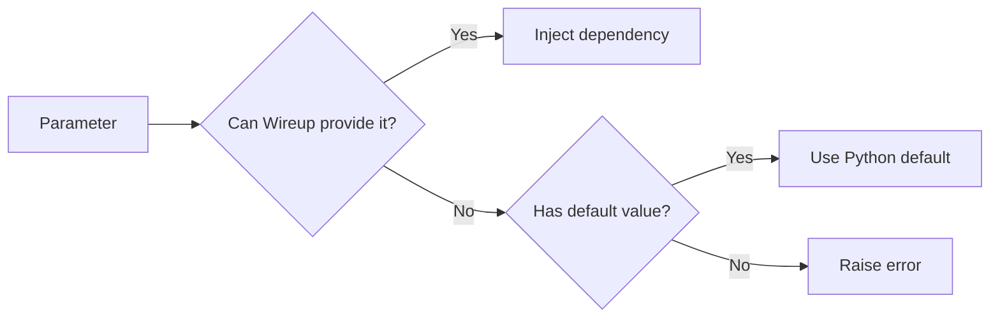

An injectable is any class or function that you register with the container, making it available to be requested as a
dependency. Once registered, Wireup can instantiate it, resolve its own dependencies, and inject it wherever needed.

## The `@injectable` Decorator

The `@injectable` decorator marks a class or function for registration with the container.

=== "Classes"

    ```python
    from wireup import injectable


    @injectable
    class UserRepository: ...
    ```

=== "Functions"

    ```python
    from wireup import injectable


    @injectable
    def db_connection() -> DatabaseConnection: ...
    ```

### Arguments

You can customize how an injectable is registered by passing arguments to the decorator:

| Argument    | Description                                                                                                           | Default       |
| :---------- | :-------------------------------------------------------------------------------------------------------------------- | :------------ |
| `lifetime`  | Controls how long the object lives (e.g., `"singleton"`, `"scoped"`). See [Lifetimes](lifetimes_and_scopes.md).       | `"singleton"` |
| `qualifier` | A unique identifier, useful when you have multiple implementations of the same type. See [Interfaces](interfaces.md). | `None`        |
| `as_type`   | Register the object as a different type (like a Protocol or Base Class). See [Interfaces](interfaces.md).             | `None`        |

```python
from wireup import injectable


@injectable(lifetime="scoped", qualifier="readonly")
class DbSession: ...
```

## Defining Dependencies

Wireup resolves dependencies using **Type Hints**. It inspects the types you declare and automatically finds the
matching injectable.

### Classes

Standard Python classes with type-hinted `__init__` methods are automatically wired. No extra configuration is needed.

```python
from wireup import injectable


@injectable
class UserService:
    # UserRepository will be injected automatically
    def __init__(self, repo: UserRepository) -> None:
        self.repo = repo
```

### Factories

Functions can be registered as factories. This is standard for creating 3rd-party objects, when complex setup is
required or for enforcing clean architecture.

See [Factories](factories.md) and [Resource Management](resources.md).

```python
import boto3
from wireup import injectable, Inject
from typing import Annotated


@injectable
def create_s3_client(
    region: Annotated[str, Inject(config="aws_region")],
) -> boto3.client:
    return boto3.client("s3", region_name=region)
```

### Dataclasses

You can combine `@injectable` with `@dataclass` to eliminate `__init__` boilerplate.

=== "Standard Class"

    ```python
    @injectable
    class OrderProcessor:
        def __init__(
            self,
            payment_gateway: PaymentGateway,
            inventory_service: InventoryService,
        ):
            self.payment_gateway = payment_gateway
            self.inventory_service = inventory_service
    ```

=== "Dataclass"

    ```python
    from dataclasses import dataclass


    @injectable
    @dataclass
    class OrderProcessor:
        payment_gateway: PaymentGateway
        inventory_service: InventoryService
    ```

??? warning "Counter-example"

    Mix with caution if your class has many non-dependency fields.

    ```python
    @injectable
    @dataclass
    class Foo:
        FOO_CONST = 1  # Not added to __init__ by @dataclass.
        logger = logging.getLogger(__name__)  # Not added to __init__ by @dataclass.

        # These will be added to __init__ by @dataclass
        # and marked as dependencies by Wireup.
        payment_gateway: PaymentGateway
        inventory_service: InventoryService
        order_repository: OrderRepository
    ```

    In this example, due to how the `@dataclass` decorator works, combining the two leads to code that's more difficult to
    read, since it's not immediately obvious what are dependencies and what are class fields.

## Optional Dependencies and Default Values

Wireup thinks about constructor parameters in terms of **satisfiability**: can this parameter be provided by either 
Wireup or by Python itself?

When Wireup encounters a dependency it doesn't recognize, it normally raises an error. However, if that parameter has an
explicit **default value**, Wireup will skip it and let Python use the default instead.

This means there are two different ways an optional-looking dependency can work.



### 1. Optional by Default Value

If a parameter has a default value, Wireup will still try to provide it first. The default is only used when Wireup
does not know how to provide that dependency:

```python
from wireup import injectable


@injectable
class UserService:
    def __init__(self, cache: Redis | None = None) -> None:
        self.cache = cache
```

This is valid even if `Redis` is not registered, because the constructor is still satisfiable without Wireup creating
the dependency. If `Redis` is registered, Wireup provides it instead of using the default.

This is also useful when integrating with libraries that add their own `__init__` parameters, such as Pydantic
Settings:

```python
from pydantic_settings import BaseSettings
from wireup import injectable


@injectable
class Settings(BaseSettings):
    app_name: str = "myapp"
    debug: bool = False
```

In this example, Pydantic's `BaseSettings` adds parameters that Wireup doesn't manage. Since they have defaults, Wireup
allows the class to be registered without errors.

### 2. Optional by Factory

If there is no default value, Wireup still needs a registered way to satisfy the parameter. For dependencies where
`None` is a valid result, register a factory that returns `T | None`:

```python
from wireup import injectable


@injectable
def cache_factory(settings: Settings) -> Redis | None:
    if not settings.use_cache:
        return None

    return Redis.from_url(settings.redis_url)


@injectable
class UserService:
    def __init__(self, cache: Redis | None) -> None:
        self.cache = cache
```

In this case the dependency is optional at runtime, but it is still explicitly part of the dependency graph because
Wireup has a registered way to resolve `Redis | None`.

When you register a dependency this way, you should also request it as `Redis | None` (or `Optional[Redis]`).

See [Factories: Optional Dependencies](factories.md#optional-dependencies) and
[Interfaces: Optional Binding](interfaces.md#optional-binding).

### Optional Value vs Optional Registration

These two cases are easy to confuse:

- `client: Client | None = None`
- `cache: Redis | None = None`
  Wireup may ignore the parameter entirely and let Python use the default. No registration is required.
- `cache: Redis | None`
  Wireup must still be able to satisfy the parameter. Without a registered binding, container creation fails.

If you want to make a dependency skippable without requiring any DI setup, use a default value. If you want the
dependency to remain part of the dependency graph but sometimes resolve to `None`, register a factory that returns an
optional type.

### When to Use Which

- Use a **default value** when the dependency is genuinely optional and your class has a sensible fallback behavior.
- Use a **registered optional factory** when the dependency is part of the application graph but may be disabled by
  configuration or runtime state.
- Prefer a **Null Object** when consumers should not need repeated `if dep is not None` checks.

## Next Steps

- [Configuration](configuration.md) - Inject configuration values.
- [Lifetimes & Scopes](lifetimes_and_scopes.md) - Control how long objects live.
- [Factories](factories.md) - Advanced creation logic.
