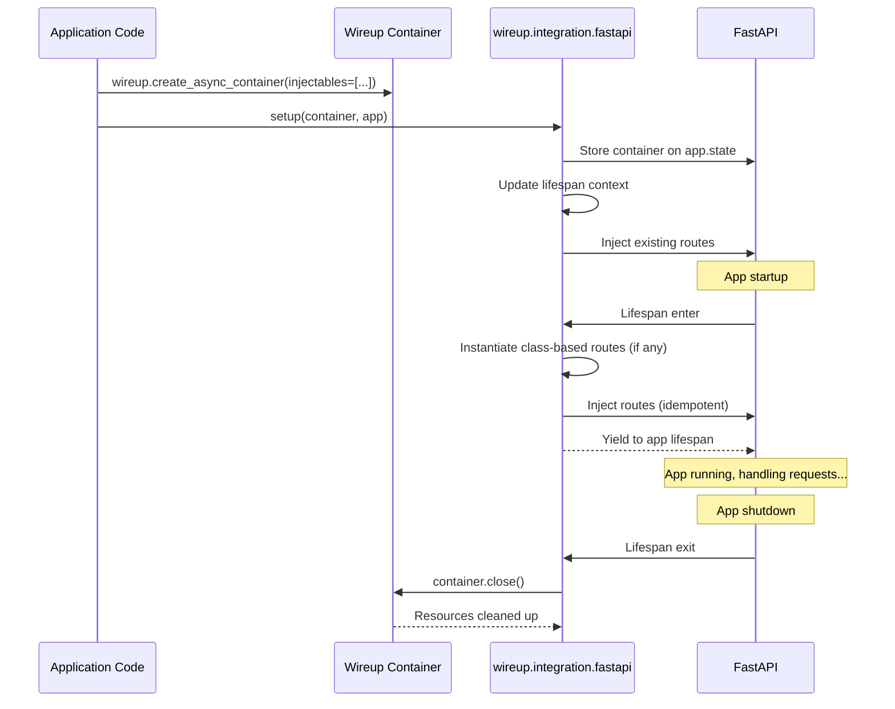
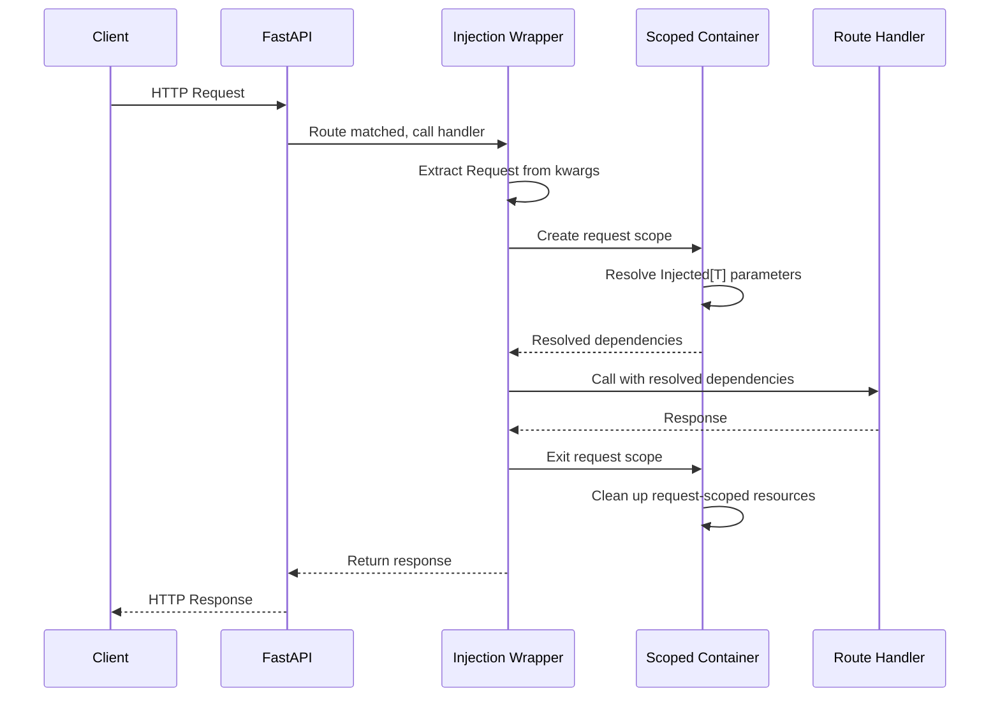

# :simple-fastapi:{.color-fastapi} FastAPI Integration

<div class="grid cards annotate" markdown>

- :material-transit-connection-variant:{ .lg .middle } __Deep Integration__

    ______________________________________________________________________

    Inject anywhere in the request path, not just route handlers, without manually threading dependencies through each call.

    [:octicons-arrow-right-24: Learn more](request_time_injection.md)

- :material-speedometer:{ .lg .middle } __Zero Runtime Overhead__

    ______________________________________________________________________

    Inject dependencies with **zero** runtime overhead using Class-Based Handlers.

    [:octicons-arrow-right-24: Learn more](class_based_handlers.md)

- :material-timer-cog-outline:{ .lg .middle } __Background Tasks__

    ______________________________________________________________________

    Inject dependencies into scheduled background callbacks via `WireupTask`.

    [:octicons-arrow-right-24: Learn more](background_tasks.md)

- :material-share-circle:{ .lg .middle } __Framework-Agnostic__

    ______________________________________________________________________

    Share your service layer with CLI tools, background workers, and other frameworks.

</div>

!!! tip "Migrating from FastAPI Depends?"

    Evaluating Wireup for your FastAPI project? Check out the migration page which includes common pain points with FastAPI Depends and how to solve them with Wireup as well
    as a low-friction migration path:

    [Migrate from FastAPI Depends to Wireup](../../migrate_to_wireup/fastapi_depends.md).

## Quick Start

This is the shortest path to a working FastAPI endpoint with Wireup injection.

```python title="main.py"
from fastapi import FastAPI
import wireup
import wireup.integration.fastapi
from wireup import Injected, injectable


# 1. Define services
@injectable
class GreeterService:
    def greet(self, name: str) -> str:
        return f"Hello, {name}!"


# 2. Create container
container = wireup.create_async_container(injectables=[GreeterService])

app = FastAPI()


# 3. Use Injected[T] in routes for Wireup injection
@app.get("/")
async def greet(greeter: Injected[GreeterService]):
    return {"message": greeter.greet("World")}


# 4. Initialize Wireup integration
wireup.integration.fastapi.setup(container, app)
```
Best practice is to call `setup(...)` after routes are added.

Run the server with:

```bash
fastapi dev main.py
```

## Lifecycle

Wireup integrates with FastAPI at two levels: once during application startup/shutdown, and once per incoming request.

### App Lifecycle

Container creation, route injection, and teardown.



### Per-Request Lifecycle

Scope creation, dependency resolution, and cleanup for a single HTTP request.



## Detailed Guides

- [Inject in Routes](inject_in_routes.md): HTTP/WebSocket handler injection and config value injection in route signatures.
- [Request and WebSocket Context in Services](context_in_services.md): inject `fastapi.Request` and `fastapi.WebSocket` into Wireup services.
- [Class-Based Handlers](class_based_handlers.md): zero per-request constructor resolution and `WireupRoute` optimizations.
- [Request-Time Injection](request_time_injection.md): injection in decorators, middleware, and other request-time call sites.
- [Background Tasks](background_tasks.md): inject dependencies into scheduled callbacks with `WireupTask`.
- [FastAPI Testing](testing.md): `TestClient` lifespan usage, overrides, and request-lifecycle tests.
- [Troubleshooting](troubleshooting.md): common setup/runtime errors and fast fixes.

## API Reference

- [fastapi_integration](../../class/fastapi_integration.md)
