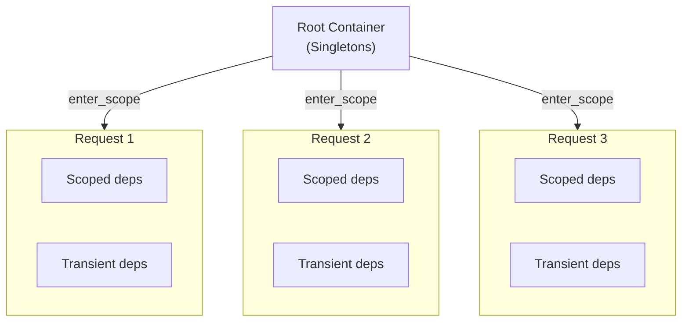

Wireup controls how long instances live and when they're shared through **lifetimes** and **scopes**.

## Why Scopes?

Some resources need isolation. For example:

- **Database transactions** should be independent per request
- **User context** should not leak between requests
- **Temporary objects** should be created fresh each time

Scopes solve this by providing isolated contexts with automatic cleanup. When a scope ends, Wireup automatically
releases resources created within that scope.

## Lifetimes

Wireup provides three lifetime options that control instance creation and sharing. Configure the lifetime using the
`@injectable` decorator.

### Quick Reference

| Lifetime  | Instance Creation  | Shared Within      | Retrieved From | Best For                                     |
| --------- | ------------------ | ------------------ | -------------- | -------------------------------------------- |
| Singleton | Once per container | Entire application | Root or scoped | Configuration, database connections, caching |
| Scoped    | Once per scope     | Current scope only | Scoped only    | Request state, transactions, user sessions   |
| Transient | Every resolution   | Never shared       | Scoped only    | Stateless objects, temporary objects         |

!!! important "Container Access Rules"

    The **root container** is the one you create during setup via `wireup.create_sync_container` or
    `wireup.create_async_container`. A **scoped container** is created from it using `container.enter_scope()`.

    - Root container (`container.get()`) can only retrieve **singletons**
    - Scoped container (`scope.get()`) can retrieve **singletons, scoped, and transient** dependencies
    - Scoped containers automatically look up singletons from the root container

### Singleton (Default)

One instance is created and shared across the entire application:

```python
@injectable  # lifetime="singleton" is the default
class Database:
    def __init__(self): ...


# Same instance everywhere
db1 = container.get(Database)  # Instance created
db2 = container.get(Database)  # Reuses instance
assert db1 is db2  # True
```

!!! tip

    Singletons are lazy by default. See [Eager Initialization](container.md#eager-initialization) to initialize them at
    startup.

### Scoped

One instance per scope, shared within that scope:

```python
@injectable(lifetime="scoped")
class RequestContext:
    def __init__(self):
        self.request_id = uuid.uuid4()


with container.enter_scope() as scope1:
    ctx1 = scope1.get(RequestContext)
    ctx2 = scope1.get(RequestContext)
    assert ctx1 is ctx2  # Same instance within scope

with container.enter_scope() as scope2:
    ctx3 = scope2.get(RequestContext)
    assert ctx1 is not ctx3  # Different instance in different scope
```

### Transient

Creates a new instance on every resolution:

```python
@injectable(lifetime="transient")
class MessageBuilder:
    def __init__(self):
        self.timestamp = time.time()


with container.enter_scope() as scope:
    builder1 = scope.get(MessageBuilder)
    builder2 = scope.get(MessageBuilder)
    assert builder1 is not builder2  # Always different instances
```

### Cleanup Timing

- **Singleton** cleanup happens when `container.close()` is called (application shutdown)
- **Scoped** cleanup happens when the scope exits (end of request/context)
- **Transient** cleanup happens when the **scope that created them** exits

## Working with Scopes

Scopes provide isolated contexts. This is useful for things like database sessions or user context that should only
exist for a short duration (like a single HTTP request).



Each call to `enter_scope()` creates an isolated scoped container with its own scoped and transient dependencies.

=== "Web Frameworks"

    When using [Integrations](integrations/index.md) (like FastAPI, Flask, Django), **scopes are handled automatically**. A
    new scope is created for every incoming request and closed when the request finishes.

    ```python
    @app.get("/users/me")
    def get_current_user(auth_service: Injected[AuthService]):
        return auth_service.get_current_user()
    ```

=== "Function Decorator"

    The [`@wireup.inject_from_container`](function_injection.md) automatically enters a new scope before the function runs
    and closes it afterwards, ensuring cleanup is performed.

    ```python
    @wireup.inject_from_container(container)
    def process_order(order_service: Injected[OrderService]):
        return order_service.process()
    ```

=== "Manual Context"

    For granular control, you can manage scopes manually using `container.enter_scope()`.

    **Synchronous**

    ```python
    container = wireup.create_sync_container(injectables=[RequestService])

    with container.enter_scope() as scope:
        # Resolve dependencies from this specific scope
        service = scope.get(RequestService)
        service.process()

    # When the block exits, the scope is closed and cleanup runs.
    ```

    **Asynchronous**

    ```python
    container = wireup.create_async_container(injectables=[RequestService])

    async with container.enter_scope() as scope:
        service = await scope.get(RequestService)
        service.process()
    ```

### Resource Cleanup

Scoped containers ensure that resources are released when the scope exits. This simplifies resource management for
things like database transactions or file handles.

See [Resources & Cleanup](resources.md) for details on creating cleanable resources using generator factories.

## Lifetime Dependency Rules

Dependencies have restrictions on what they can depend on to prevent **Scope Leakage**:

- **Singletons** can only depend on other singletons and config.
- **Scoped** can depend on singletons, scoped, and config.
- **Transient** can depend on any lifetime and config.

## Concurrent Access

Scopes are typically accessed by a single thread or asyncio task (e.g., one web request). By default, Wireup does **not
use locks** for scoped dependencies, optimizing for this common pattern.

### When to Enable Locking

If you need to share a scope across multiple concurrent tasks, such as, parallelizing work within a request while
sharing a common context, enable `concurrent_scoped_access` when creating the container:

```python
container = wireup.create_async_container(
    injectables=[...],
    concurrent_scoped_access=True,  # Safe for shared scopes
)
```

!!! note

    This is an advanced use case. Most applications don't need this.

## Next Steps

- [Factories](factories.md) - Create complex dependencies with setup and teardown logic.
- [Interfaces](interfaces.md) - Register multiple implementations of the same type.
- [Testing](testing.md) - Override dependencies for testing.
