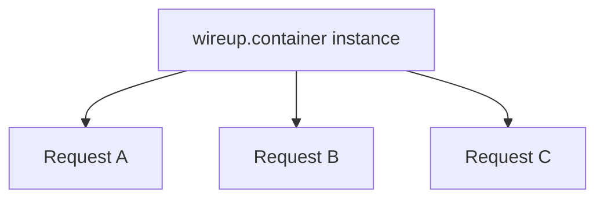

## Lifetime Examples

Assume a container with the following services

```python
@service
class GreeterService: ...

@service(lifetime=ServiceLifetime.SCOPED)
class TransactionManager: ...

@service(lifetime=ServiceLifetime.TRANSIENT)
class Transaction: ...
```

=== "Synchronous"

    ```python title="greeter_service.py"
    g1 = container.get(GreeterService)


    with wireup.enter_scope(container) as scoped:
        g2 = container.get(GreeterService)
        g3 = container.get(GreeterService)
    ```

=== "Async"
    Here we cannot use the regular `container.get` method as one of the underlying dependencies is async.

    ```python title="di/factories.py"
    from wireup import service

    @service
    async def make_http_client() -> AsyncIterator[aiohttp.ClientSession]:
        async with aiohttp.ClientSession() as client:
            yield client
    ```

    ```python title="services/weather_service.py"
    @service
    class WeatherService:
        def __init(
            self,
            api_key: Annotated[str, Inject(param="weather_api_key")],
            kv_store: KeyValueStore,
            client: aiohttp.ClientSession,
        ) -> None:
            self.api_key = api_key
            self.kv_store = kv_store
            self.client = client
    ```

    ```python
    weather_service = await container.aget(WeatherService)
    ```



