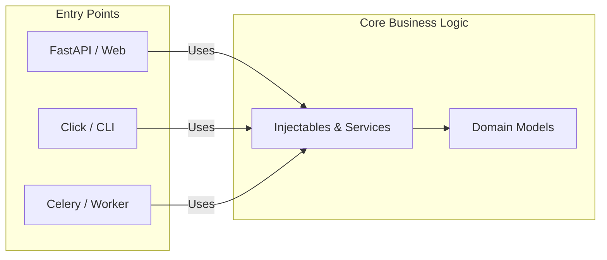

<div align="center">
<h1>Wireup</h1>
<p>Performant, concise and type-safe Dependency Injection for Python</p>

[](https://github.com/maldoinc/wireup)
[](https://github.com/maldoinc/wireup)
[](https://pypi.org/project/wireup/)
[](https://pypi.org/project/wireup/)
[](https://maldoinc.github.io/wireup)
</div>

Automate dependency management using Python's type system. Build complex applications with native support for async and generators, plus integrations for popular frameworks out of the box.

> [!TIP]
> **New**: Inject Dependencies in FastAPI with zero runtime overhead using [Class-Based Handlers](https://maldoinc.github.io/wireup/latest/integrations/fastapi/class_based_handlers/).


## 📦 Installation

```bash
pip install wireup
```

## Features
 
### ⚡ Clean & Type-Safe DI
 
Use decorators and annotations for concise, co-located definitions, or factories to keep your domain model pure and decoupled.
 
**1. Basic Usage**
 
Start simple. Register classes directly using decorators and let the container resolve 
dependencies automatically.
 
```python
from wireup import injectable, create_sync_container
from sqlalchemy import create_engine

@injectable
class Database:
    def __init__(self) -> None:
        self.engine = create_engine("sqlite://")

@injectable
class UserService:
    def __init__(self, db: Database) -> None:
        self.db = db

container = create_sync_container(injectables=[Database, UserService])
user_service = container.get(UserService)  # ✅ Dependencies resolved.
```


 
**2. Inject Configuration**
 
Seamlessly inject configuration alongside other dependencies, eliminating the need for 
manually wiring them up via factories.

<details>
<summary>View Code</summary>


```python
from wireup import injectable, create_sync_container, Inject
from typing import Annotated
import os
from sqlalchemy import create_engine

@injectable
class Database:
    # Inject "db_url" directly
    def __init__(self, url: Annotated[str, Inject(config="db_url")]) -> None:
        self.engine = create_engine(url)

container = create_sync_container(
    injectables=[Database],
    config={"db_url": os.environ["DB_URL"]}
)
db = container.get(Database)  # ✅ Dependencies resolved.
```

</details>

**3. Clean Architecture**
 
Need strict boundaries? Use factories to wire pure domain objects and integrate 
external libraries like Pydantic.

```python
from pydantic import BaseModel
from sqlalchemy import create_engine

# 1. No Wireup imports
class Database:
    def __init__(self, url: str) -> None:
        self.engine = create_engine(url)

# 2. Configuration (Pydantic)
class Settings(BaseModel):
    db_url: str = "sqlite://"
```

```python
from wireup import injectable, create_sync_container

# 3. Wireup factories
@injectable
def make_settings() -> Settings:
    return Settings()

@injectable
def make_database(settings: Settings) -> Database:
    return Database(url=settings.db_url)

container = create_sync_container(injectables=[make_settings, make_database])
database = container.get(Database)  # ✅ Dependencies resolved.
```

**4. Auto-Discover**

No need to list every injectable manually. Scan entire modules or packages to register all at once.

<details>
<summary>View Code</summary>

```python
import wireup
import app

container = wireup.create_sync_container(
    injectables=[
        app.services,
        app.repositories,
        app.factories
    ]
)

user_service = container.get(UserService)  # ✅ Dependencies resolved.
```

</details>

### 🎯 Function Injection

Inject dependencies directly into functions with a simple decorator.

```python
@inject_from_container(container)
def process_users(service: Injected[UserService]):
    # ✅ UserService injected.
    pass
```

### 📝 Interfaces & Abstractions

Depend on abstractions, not implementations. Bind implementations to interfaces using Protocols or ABCs.

```python
from wireup import injectable, create_sync_container
from typing import Protocol

class Notifier(Protocol):
    def notify(self) -> None: ...

@injectable(as_type=Notifier)
class SlackNotifier:
    def notify(self) -> None: ...

container = create_sync_container(injectables=[SlackNotifier])
notifier = container.get(Notifier) # ✅ SlackNotifier instance.
```


### 🔄 Managed Lifetimes

Declare dependencies as singletons, scoped, or transient to control whether to inject a fresh copy or reuse existing instances.


```python
# Singleton: One instance per application. `@injectable(lifetime="singleton")` is the default.
@injectable
class Database:
    pass

# Scoped: One instance per scope/request, shared within that scope/request.
@injectable(lifetime="scoped")
class RequestContext:
    def __init__(self) -> None:
        self.request_id = uuid4()

# Transient: When full isolation and clean state is required.
# Every request to create transient services results in a new instance.
@injectable(lifetime="transient")
class OrderProcessor:
    pass
```


### 🏭 Flexible Creation Patterns

Defer instantiation to specialized factories when complex initialization or cleanup is required.
Full support for async and generators. Wireup handles cleanup at the correct time depending on the service lifetime.

```python
class WeatherClient:
    def __init__(self, client: requests.Session) -> None:
        self.client = client

@injectable
def weather_client_factory() -> Iterator[WeatherClient]:
    with requests.Session() as session:
        yield WeatherClient(client=session)
```

### ❓ Optional Dependencies

Wireup has first-class support for `Optional[T]` and `T | None`. Expose optional dependencies and let Wireup handle the rest.

```python
@injectable
def make_cache(settings: Settings) -> RedisCache | None:
    return RedisCache(settings.redis_url) if settings.cache_enabled else None

@injectable
class UserService:
    def __init__(self, cache: RedisCache | None):
        self.cache = cache

# You can also retrieve optional dependencies directly
cache = container.get(RedisCache | None)
```


### 🛡️ Improved Safety

Wireup is mypy strict compliant and will not introduce type errors in your code. It will also warn you at the earliest possible stage about configuration errors to avoid surprises.

**Container Creation**

The container will raise errors at creation time about missing dependencies or other issues.

```python
from wireup import injectable

@injectable
class Foo:
    def __init__(self, unknown: NotManagedByWireup) -> None:
        pass

container = wireup.create_sync_container(injectables=[Foo])
# ❌ Parameter 'unknown' of 'Foo' depends on an unknown injectable 'NotManagedByWireup'.
```

**Function Injection**

Injected functions will raise errors at module import time rather than when called.

```python
from wireup import inject_from_container, Injected

@inject_from_container(container)
def my_function(oops: Injected[NotManagedByWireup]): ...

# ❌ Parameter 'oops' of 'my_function' depends on an unknown injectable 'NotManagedByWireup'.
```

**Integrations**

Wireup integrations assert that requested injections in the framework are valid.

```python
from wireup import Injected
from fastapi import FastAPI

app = FastAPI()

@app.get("/")
def home(foo: Injected[NotManagedByWireup]): ...

wireup.integration.fastapi.setup(container, app)
# ❌ Parameter 'foo' of 'home' depends on an unknown injectable 'NotManagedByWireup'.
```

### 📍 Framework Independent

With Wireup, business logic is decoupled from your runtime. Define injectables once and reuse them across
Web Applications, CLI Tools, and Task Queues without duplication or refactoring.

```python
# 1. Define your Service Layer once (e.g. in my_app.services)
# injectables = [UserService, Database, ...]

# 2. Run in FastAPI
@app.get("/")
@inject_from_container(container)
async def view(service: Injected[UserService]): ...

# 3. Run in CLI
@click.command()
@inject_from_container(container)
def command(service: Injected[UserService]): ...

# 4. Run in Workers (Celery)
@app.task
@inject_from_container(container)
def task(service: Injected[UserService]): ...
```



### 🔌 Native Integration with popular frameworks

Integrate with popular frameworks for a smoother developer experience.
Integrations manage request scopes, injection in endpoints, and dependency lifetimes.

```python title="Full FastAPI example"
from wireup import injectable, create_async_container, Injected
from fastapi import FastAPI

app = FastAPI()
container = create_async_container(injectables=[UserService, Database])

@app.get("/")
def users_list(user_service: Injected[UserService]):
    pass

wireup.integration.fastapi.setup(container, app)
```

[View all integrations →](https://maldoinc.github.io/wireup/latest/integrations/)

### 🧪 Simplified Testing

Wireup does not patch your services and lets you test them in isolation.

If you need to use the container in your tests, you can have it create parts of your services
or perform dependency substitution.

```python
with container.override.injectable(target=Database, new=in_memory_database):
    # The /users endpoint depends on Database.
    # During the lifetime of this context manager, requests to inject `Database`
    # will result in `in_memory_database` being injected instead.
    response = client.get("/users")
```

## 📚 Documentation

For more information [check out the documentation](https://maldoinc.github.io/wireup)
