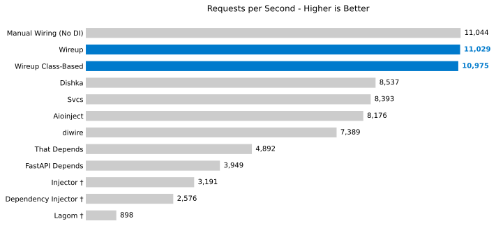

<div align="center">
<h1>Wireup</h1>
<p>
Type-driven dependency injection for Python. Wireup is battle-tested in production, thread-safe, no-GIL (PEP 703) ready, and fail-fast by design: <strong>if the container starts, it works</strong>.
</p>

[](https://github.com/maldoinc/wireup)
[](https://github.com/maldoinc/wireup)
[](https://pypi.org/project/wireup/)
[](https://pypi.org/project/wireup/)
<br />
[](https://maldoinc.github.io/wireup)
[](https://github.com/maldoinc/wireup)

</div>

<p align="center">
  <a href="#quick-start"><strong>Quick Start</strong></a> &middot;
  <a href="https://maldoinc.github.io/wireup"><strong>Docs</strong></a> &middot;
  <a href="https://maldoinc.github.io/wireup/latest/benchmarks/"><strong>Benchmarks</strong></a> &middot;
  <a href="https://maldoinc.github.io/wireup/latest/migrate_to_wireup/"><strong>Migrate to Wireup</strong></a>
</p>

## Why Wireup?

<table>
<tr>
<td align="center" valign="top" width="33%">
<h3>🔁 Define Once, Use Anywhere</h3>
Reuse the same application code in APIs, CLIs, workers, and scripts without rewriting your wiring.
</td>
<td align="center" valign="top" width="33%">
<h3>✅ Correct by Default</h3>
If the container starts, your dependency graph is valid. No missing or misconfigured dependencies, no surprises at runtime.
</td>
<td align="center" valign="top" width="33%">
<h3>🌐 Framework-Ready</h3>
Native integrations for <strong>FastAPI</strong>, <strong>Django</strong>, <strong>Flask</strong>, <strong>AIOHTTP</strong>, <strong>Starlette</strong>, <strong>Click</strong>, <strong>Typer</strong>, and more.
</td>
</tr>
<tr>
<td align="center" valign="top">
<h3>⚡ Zero-Overhead Handlers</h3>
Resolve singleton constructor dependencies once at startup in <a href="https://maldoinc.github.io/wireup/latest/integrations/fastapi/class_based_handlers/">FastAPI</a> and <a href="https://maldoinc.github.io/wireup/latest/integrations/aiohttp/class_based_handlers/">AIOHTTP</a> class-based handlers, not per request.
</td>
<td align="center" valign="top">
<h3>🧩 Advanced Composition</h3>
<a href="https://maldoinc.github.io/wireup/latest/factories/#reusable-factory-bundles">Provider-style module composition</a> and <a href="https://maldoinc.github.io/wireup/latest/lifetimes_and_scopes/">explicit scope context sharing</a> using plain Python.
</td>
<td align="center" valign="top">
<h3>🧪 Testable by Design</h3>
Override dependencies with context managers, keep tests isolated, and restore the original graph automatically.
</td>
</tr>
</table>

## Benchmarks

<p align="center">
    <picture>
    <source media="(prefers-color-scheme: dark)" srcset="docs/pages/img/benchmarks_scoped_dark.svg">
    <source media="(prefers-color-scheme: light)" srcset="docs/pages/img/benchmarks_scoped_light.svg">
    
    </picture>
</p>

<p align="center">
    <i>Dense dependency graph resolved per request in FastAPI + Uvicorn<br>
    (Requests per second, higher is better. Manual Wiring represents the upper bound.)<br>
    Full methodology and reproducibility: <a href="https://maldoinc.github.io/wireup/latest/benchmarks/">benchmarks</a>.</i>
</p>

## Installation

```bash
pip install wireup
```


## Quick Start

```python
import fastapi
import wireup
import wireup.integration.fastapi
from wireup import Injected, injectable


@injectable
class Database:
    def query(self, sql: str) -> list[str]: ...


@injectable
class UserService:
    def __init__(self, db: Database) -> None:
        self.db = db

    def get_users(self) -> list[str]:
        return self.db.query("SELECT name FROM users")


app = fastapi.FastAPI()


@app.get("/users")
def get_users(service: Injected[UserService]) -> list[str]:
    return service.get_users()


container = wireup.create_async_container(injectables=[Database, UserService])
wireup.integration.fastapi.setup(container, app)
```

For a full end-to-end walkthrough, start with the [Getting Started guide](https://maldoinc.github.io/wireup/latest/getting_started/).

## How It Looks in Practice

Use decorators and annotations for concise, co-located definitions, or factories to keep your domain model pure and decoupled.

**1. Basic Usage**

Register classes with `@injectable` and let the container resolve dependencies automatically.

```python
@injectable
class Database:
    def __init__(self) -> None:
        self.engine = sqlalchemy.create_engine("sqlite://")

@injectable
class UserService:
    def __init__(self, db: Database) -> None:
        self.db = db

container = wireup.create_sync_container(injectables=[Database, UserService])

# Inject via framework integration or @inject_from_container (recommended)
@app.get("/users")
def get_users(service: Injected[UserService]) -> list[str]: ...

# Or resolve directly for advanced use cases (middleware, startup, scripts)
user_service = container.get(UserService)
```

**2. Inject Configuration**

Inject configuration alongside dependencies. No need to write factories just to pass a config value.

<details>
<summary>View Code</summary>

```python
@injectable
class Database:
    def __init__(self, url: Annotated[str, Inject(config="db_url")]) -> None:
        self.engine = sqlalchemy.create_engine(url)

container = wireup.create_sync_container(
    injectables=[Database],
    config={"db_url": os.environ["DB_URL"]}
)
```

</details>

**3. Clean Architecture**

Need strict boundaries? Use factories to wire pure domain objects and integrate external libraries like Pydantic.

```python
# 1. No Wireup imports
class Database:
    def __init__(self, url: str) -> None:
        self.engine = create_engine(url)

# 2. Configuration (Pydantic)
class Settings(BaseModel):
    db_url: str = "sqlite://"
```

```python
# 3. Wireup factories
@injectable
def make_settings() -> Settings:
    return Settings()

@injectable
def make_database(settings: Settings) -> Database:
    return Database(url=settings.db_url)

container = wireup.create_sync_container(injectables=[make_settings, make_database])
```

**4. Auto-Discover**

No need to list every injectable manually. Scan entire modules or packages to register all at once. This is the recommended default for larger applications.

<details>
<summary>View Code</summary>

```python
import app
import wireup

container = wireup.create_sync_container(
    injectables=[
        app.services,
        app.repositories,
        app.factories
    ]
)
```

</details>

## More Features

### 🎯 Function Injection

Inject dependencies into CLI commands, background tasks, event handlers, or any standalone function that needs container access.

```python
@inject_from_container(container)
def migrate_database(db: Injected[Database], settings: Injected[Settings]) -> None:
    ...
```

### 📝 Interfaces & Abstractions

Bind implementations to interfaces using Protocols or ABCs.

```python
class Notifier(Protocol):
    def notify(self) -> None: ...

@injectable(as_type=Notifier)
class SlackNotifier:
    def notify(self) -> None: ...

container = create_sync_container(injectables=[SlackNotifier])

# SlackNotifier is injected wherever Notifier is requested
@app.post("/notify")
def send_notification(notifier: Injected[Notifier]) -> None:
    notifier.notify()
```

### 🏭 Flexible Creation Patterns

Use factories when initialization or cleanup is non-trivial. Wireup supports sync, async, and generator factories and cleans them up at the right lifetime boundary.

```python
class WeatherClient:
    def __init__(self, client: requests.Session) -> None:
        self.client = client

@injectable
def weather_client_factory() -> Iterator[WeatherClient]:
    with requests.Session() as session:
        yield WeatherClient(client=session)
```

<details>
<summary>Async example</summary>

```python
class WeatherClient:
    def __init__(self, client: aiohttp.ClientSession) -> None:
        self.client = client

@injectable
async def weather_client_factory() -> AsyncIterator[WeatherClient]:
    async with aiohttp.ClientSession() as session:
        yield WeatherClient(client=session)
```

</details>


### 🔄 Lifetimes & Scopes

Declare dependencies as `singleton`, `scoped`, or `transient` to control reuse explicitly.

```python
# Singleton: one instance per application (default)
@injectable
class Settings:
    pass

# Async singleton with cleanup — no lru_cache, no app.state
@injectable
async def database_factory(settings: Settings) -> AsyncIterator[AsyncConnection]:
    async with create_async_engine(settings.db_url).connect() as connection:
        yield connection

# Scoped: one instance per request, shared within that request
@injectable(lifetime="scoped")
class RequestContext:
    def __init__(self) -> None:
        self.request_id = uuid4()

# Transient: fresh instance every time
@injectable(lifetime="transient")
class OrderProcessor:
    pass
```

### 🛡️ Startup Validation

Wireup validates the dependency graph when the container is created.

```python
# Missing dependencies: caught at startup, not at runtime
@injectable
class Foo:
    def __init__(self, unknown: NotManagedByWireup) -> None: ...

container = wireup.create_sync_container(injectables=[Foo])
# ❌ Parameter 'unknown' of 'Foo' depends on an unknown injectable 'NotManagedByWireup'.
```

It also catches circular dependencies, duplicate registrations, misconfigured lifetimes, and missing config at startup.

### 🧪 Testing

Wireup decorators only collect metadata. Injectables are plain classes and functions, so you can test them directly with no special setup.

Swap dependencies during tests with `container.override`:

```python
with container.override.injectable(target=Database, new=in_memory_database):
    # All code that depends on Database will receive in_memory_database
    # for the duration of this context manager
    response = client.get("/users")
```

## 📚 Documentation

See the docs for integrations, lifetimes, factories, testing, and advanced patterns.

[https://maldoinc.github.io/wireup](https://maldoinc.github.io/wireup)
